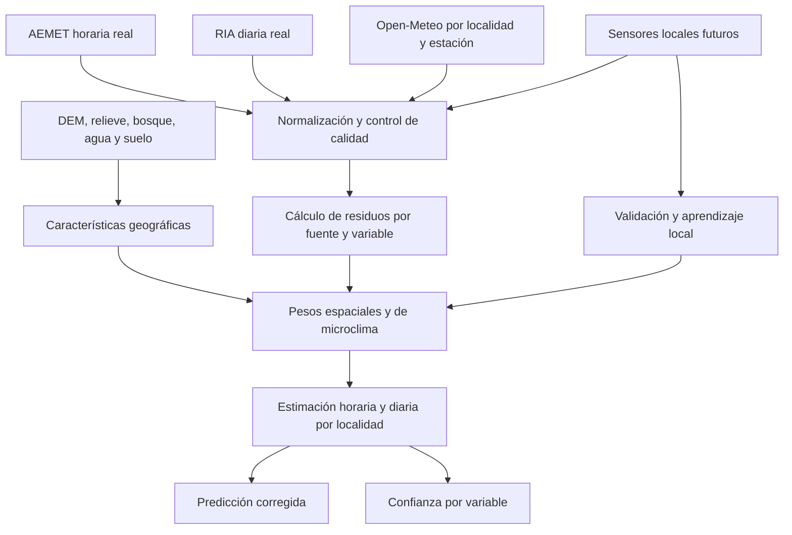

# Especificación del algoritmo meteorológico comarcal

## Objetivo

Estimar condiciones meteorológicas útiles para el día a día en las capitales municipales de:

- Huéscar
- Puebla de Don Fadrique
- Castril
- Galera
- Orce
- Castilléjar

El sistema combina:

- AEMET 5051X como observación real horaria.
- RIA GR02 como observación real diaria en Puebla de Don Fadrique.
- Open-Meteo como campo meteorológico espacial y predictivo.
- Variables geográficas estáticas: elevación, pendiente, orientación, relieve, cobertura forestal, uso del suelo y proximidad a masas de agua.
- Sensores locales futuros para validar y aprender el microclima de cada localidad.

Las salidas para localidades sin estación son estimaciones corregidas, no observaciones reales.

## Productos

### Estado horario estimado

Representa la mejor aproximación disponible para la hora de referencia.

Variables prioritarias:

- temperatura y sensación térmica;
- humedad;
- precipitación;
- viento medio, dirección y rachas;
- presión;
- nubosidad, visibilidad y código meteorológico;
- radiación solar.

### Resumen diario

- temperaturas media, mínima y máxima;
- humedad media, mínima y máxima;
- precipitación acumulada;
- viento medio y racha máxima;
- radiación acumulada;
- ET0;
- horas de sol y eventos relevantes.

### Predicción horaria

Horizonte inicial de 48 horas, corregido con errores históricos de AEMET, RIA y sensores locales.

### Predicción diaria

Horizonte inicial de 7 días, con confianza decreciente por plazo y variable.

## Principio del algoritmo

Open-Meteo aporta el patrón espacial base. Las estaciones reales no se trasladan directamente a otros pueblos: se utilizan para calcular el error del modelo en sus ubicaciones. Ese error se interpola hacia cada localidad según su similitud geográfica y meteorológica.

Para una variable `v`, localidad `l` y tiempo `t`:

```text
estimación(v,l,t) =
  OpenMeteo(v,l,t)
  + peso_AEMET(v,l,t) × residuo_AEMET(v,t)
  + peso_RIA(v,l,t) × residuo_RIA(v,día)
  + corrección_microclima(v,l,t)
  + corrección_sensor_local(v,l,t)
```

```text
residuo_estación = observación_real_estación - OpenMeteo_en_estación
```

RIA solo interviene directamente en productos diarios. En productos horarios, su histórico sirve para aprender sesgos diarios y microclimas, pero no se trata como una medición horaria.

## Flujo



## Características geográficas

Cada localidad tendrá un perfil estático versionado:

- coordenadas y altitud urbana;
- pendiente media y orientación dominante en radios de 1, 5 y 15 km;
- elevación media, mínima, máxima y desviación en esos radios;
- índice de encajamiento en valle;
- barreras orográficas por sectores de viento;
- distancia y diferencia de cota respecto a AEMET y RIA;
- porcentaje forestal, agrícola, urbano y suelo desnudo;
- distancia a embalses, ríos y masas de agua relevantes;
- rugosidad superficial;
- exposición solar;
- clase inicial de microclima.

Fuentes previstas:

- modelo digital de elevaciones Copernicus DEM o equivalente;
- SIOSE/CORINE para uso y cobertura del suelo;
- cartografía hidrográfica oficial;
- inventario forestal y cartografía de montes;
- observaciones históricas de viento para calcular direcciones dominantes estacionales.

## Peso de las estaciones

El peso de cada estación se calcula por variable. No existe un único peso global.

```text
peso =
  disponibilidad
  × frescura
  × similitud_altitud
  × proximidad_geográfica
  × conectividad_orográfica
  × similitud_cobertura
  × compatibilidad_viento
  × rendimiento_histórico
```

### Proximidad y altitud

La distancia se penaliza suavemente. La diferencia de altitud se penaliza con intensidad distinta según variable:

- alta para temperatura;
- media para humedad y precipitación;
- baja para presión ajustada al nivel del mar;
- condicionada por exposición para viento.

### Conectividad orográfica

Se calcula un coste topográfico entre estación y localidad:

- barreras montañosas reducen el peso;
- pertenecer al mismo valle o corredor lo aumenta;
- la exposición a la dirección dominante modifica viento y precipitación;
- situaciones de inversión térmica nocturna aumentan el peso de localidades con encajamiento similar.

### Microclima

Inicialmente se usan clases explicables:

- valle encajado;
- altiplano expuesto;
- piedemonte;
- entorno forestal;
- entorno seco agrícola;
- influencia de masa de agua.

Cuando existan sensores suficientes, estas clases serán reemplazadas gradualmente por correcciones aprendidas por localidad, variable, estación y situación meteorológica.

## Tratamiento por variable

### Temperatura

- Corrección base por residuo de AEMET.
- Residuo diario RIA para corregir el ciclo diario de la zona oriental.
- Gradiente térmico dinámico derivado de Open-Meteo y sensores, no un valor fijo permanente.
- Corrección nocturna por inversión térmica, encajamiento y cielo despejado.
- Corrección diurna por orientación, radiación, bosque y urbanización.

### Humedad

- Corrección conjunta con temperatura.
- Influencia de vegetación, agua cercana y humedad antecedente.
- Diferenciación entre situaciones secas con viento y noches de inversión.
- Límites físicos entre 0 y 100%.

### Precipitación

- Corrección multiplicativa, no aditiva.
- Peso fuerte de relieve, exposición y dirección del flujo húmedo.
- Separación entre ausencia de lluvia, evento débil y evento convectivo.
- Confianza reducida durante tormentas locales.

### Viento y rachas

- Transformación vectorial de velocidad y dirección.
- Corrección por orientación de valle, barreras y rugosidad.
- Rachas calibradas separadamente del viento medio.
- Mayor incertidumbre en Castril y zonas de relieve complejo hasta disponer de sensores.

### Presión

- Ajuste por altitud y temperatura.
- Comparación en presión reducida al nivel del mar antes de trasladar residuos.

### Radiación, nubosidad y visibilidad

- Radiación corregida por orientación, pendiente y sombreado orográfico.
- Nubosidad basada principalmente en el modelo.
- Visibilidad penalizada por humedad, precipitación y relieve.

### ET0

Se recalcula a partir de temperatura, humedad, viento y radiación corregidos. No se traslada directamente desde RIA.

## Escalas temporales

### Horaria actual

- AEMET y Open-Meteo alineados a la misma hora.
- RIA solo aporta sesgo histórico diario.
- Sensores locales, cuando existan, tienen prioridad dentro de su radio representativo.

### Diaria observada

- AEMET se agrega a día local.
- RIA se compara directamente como agregado diario.
- Open-Meteo diario se corrige con ambos residuos.

### Predicción

- El sesgo se aprende por variable, localidad, mes, hora y plazo.
- Los pesos históricos usan decaimiento temporal.
- Los eventos recientes similares tienen mayor peso.
- La confianza disminuye con el horizonte.

## Confianza

La confianza se calcula por localidad, variable y horizonte. La confianza general es un resumen conservador, no una media simple.

Factores:

- disponibilidad y frescura de AEMET/RIA;
- error histórico de Open-Meteo;
- error histórico del algoritmo en sensores locales;
- distancia efectiva y barreras orográficas;
- diferencia de altitud;
- resolución del modelo;
- tipo de fenómeno;
- plazo de predicción;
- desacuerdo entre fuentes.

Estados propuestos:

- `ALTA`: adecuada para decisiones cotidianas.
- `MEDIA`: útil con precaución.
- `BAJA`: fenómeno local, fuente retrasada o falta de validación.

## Objetivos iniciales de error

Son objetivos prácticos para uso cotidiano y deberán recalibrarse con sensores:

| Variable | Objetivo horario inicial |
| --- | --- |
| Temperatura | MAE menor de 1,5 °C |
| Humedad | MAE menor de 10 puntos |
| Viento medio | MAE menor de 8 km/h |
| Rachas | MAE menor de 15 km/h |
| Precipitación | detección correcta del evento y error diario menor de 3 mm en eventos moderados |
| Presión | MAE menor de 2 hPa |

Las alertas no dependerán solo del valor estimado: exigirán confianza mínima o confirmación de varias fuentes.

## Persistencia

Tablas previstas:

- `location_profiles`: características geográficas por localidad.
- `station_residuals`: residuos AEMET/RIA/Open-Meteo normalizados.
- `local_sensor_observations`: observaciones de sensores propios.
- `location_estimates`: estimaciones horarias y diarias.
- `location_forecasts`: predicciones corregidas.
- `location_validation_metrics`: MAE, sesgo, RMSE y detección de eventos.
- `model_versions`: versión, parámetros y fecha de activación.

Toda salida debe guardar:

- versión del algoritmo;
- fuentes utilizadas;
- pesos efectivos;
- correcciones aplicadas;
- confianza por variable;
- timestamp y horizonte.

## Endpoint técnico

Endpoint inicial:

```text
GET /api/weather/comarca
```

Evolución propuesta:

```text
GET /api/weather/comarca/current
GET /api/weather/comarca/hourly?hours=48
GET /api/weather/comarca/daily?days=7
GET /api/weather/comarca/metrics
```

RIA y AEMET podrán figurar en la trazabilidad técnica del endpoint, pero no se presentarán como observaciones reales de localidades donde no están instaladas.

## Fases de implementación

### Fase 1: perfiles geográficos

Crear y versionar perfiles para las seis capitales municipales.

Estado: implementada la versión `geo-v1.0.0`.

- Relieve: malla de 9 elevaciones alrededor de cada capital, radio de 5 km.
- Variables derivadas: elevación central, media, extremos, rango, desviación, orientación dominante, pendiente aproximada e índice de exposición/valle.
- Ambiente: distancia al elemento cartografiado más cercano de agua y bosque, más conteos de elementos en 15 km.
- Fuentes actuales: elevación de Open-Meteo y cartografía OpenStreetMap mediante Overpass.
- Los conteos OSM indican densidad de elementos cartografiados; no equivalen a porcentaje de cobertura forestal o hídrica.
- Endpoint técnico: `GET /api/weather/geographic-profiles`.
- Regeneración protegida: `POST /api/weather/geographic-profiles` con `Authorization: Bearer $CRON_SECRET`.
- Cliente Sentinel Hub implementado con OAuth2 `client_credentials`, caché del token y acceso tipado a Statistical API.
- El cliente selecciona automáticamente Sentinel Hub comercial o Copernicus Data Space según el formato del Client ID; los clientes `sh-*` usan `identity.dataspace.copernicus.eu` y `sh.dataspace.copernicus.eu`.
- Smoke test protegido: `POST /api/weather/sentinel-hub-smoke-test` con `Authorization: Bearer $CRON_SECRET`.
- El smoke test calcula estadísticas mensuales recientes de vegetación densa, agua y nubosidad en un área de prueba alrededor de Huéscar.
- Prueba real CDSE completada: 3 intervalos mensuales, 10.260 píxeles en el primer intervalo y aproximadamente 28,5 % de vegetación densa en el área de prueba.
- Coberturas Sentinel persistidas en `location_profiles` versión activa `geo-v1.1.0` para radios de 1, 5 y 15 km de las seis capitales.
- Resoluciones usadas: 20 m en 1 km, 50 m en 5 km y 100 m en 15 km. Cada resultado agrega 12 intervalos mensuales del último año y conserva nubosidad e intervalos válidos.
- Los campos `vegetationPct` y `denseVegetationPct` son indicadores espectrales por NDVI; `waterDetectedPct` combina SCL y NDWI. No equivalen todavía a clases oficiales de bosque o masa de agua.

### Fase 2: residuos multifuente

Normalizar AEMET horario, AEMET diario, RIA diario y Open-Meteo para calcular residuos comparables.

### Fase 3: interpolación espacial explicable

Implementar pesos por distancia efectiva, altitud, relieve, cobertura y viento.

### Fase 4: sensores locales

Instalar sensores en Huéscar y Castril primero, por ser los puntos de mayor valor para validar los dos extremos espaciales y orográficos.

### Fase 5: aprendizaje supervisado

Cuando existan al menos 90 días útiles por sensor, entrenar correcciones por variable manteniendo el modelo explicable como fallback.

## Limitaciones

- Ninguna interpolación sustituye una estación local.
- Tormentas convectivas, niebla, heladas en vaguadas y rachas canalizadas son especialmente difíciles.
- La cercanía a agua o bosque no implica automáticamente un efecto medible; debe validarse históricamente.
- El modelo debe evitar falsa precisión y mostrar la antigüedad y confianza de cada estimación.
